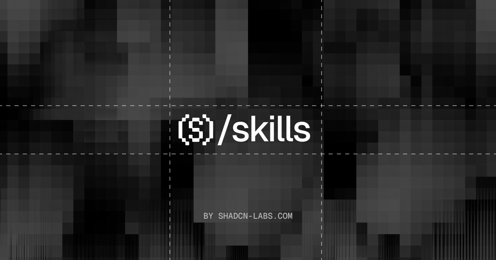

<p align="center">
  
</p>

<h1 align="center">Skills</h1>

<div align="center">

Agent skills for [Shadcn Labs](https://shadcnlabs.com). Install with the [skills CLI](https://github.com/vercel-labs/skills).

</div>

## Install

```bash
npx skills add shadcn-labs/skills
```

## Skill Overview

### launch-shadcn-registry

Launch and promote a custom shadcn/ui registry — directory PRs, community listings, and social drafts.

```bash
npx skills add https://github.com/shadcn-labs/skills --skill launch-shadcn-registry
```

[](https://skills.sh/shadcn-labs/skills/launch-shadcn-registry)

### mastra-file-agents

Migrate Mastra code-based agents (`new Agent(...)` in a `Mastra({ agents })` map) to the file-based convention — one directory per agent under `src/mastra/agents/`.

```bash
npx skills add https://github.com/shadcn-labs/skills --skill mastra-file-agents
```

[](https://skills.sh/shadcn-labs/skills/mastra-file-agents)

### tailwind-to-stylex

Migrate TailwindCSS utility classes to StyleX — resolve classes to CSS, reshape into `stylex.create`, and apply with `stylex.props` / `stylex.attrs` across React and other StyleX-supported frameworks.

```bash
npx skills add https://github.com/shadcn-labs/skills --skill tailwind-to-stylex
```

[](https://skills.sh/shadcn-labs/skills/tailwind-to-stylex)

### icon-set-generator

Draw a custom SVG icon set that actually looks like a set — locked style spec, optical size envelopes, a reusable-parts registry, plus a validator and a preview page.

```bash
npx skills add https://github.com/shadcn-labs/skills --skill icon-set-generator
```

[](https://skills.sh/shadcn-labs/skills/icon-set-generator)

### icon-set-audit

Audit an existing SVG icon set for consistency — spec drift, divergent recurring parts, near-duplicates, optical size outliers — and report what to fix in priority order.

```bash
npx skills add https://github.com/shadcn-labs/skills --skill icon-set-audit
```

[](https://skills.sh/shadcn-labs/skills/icon-set-audit)

### icon-set-extend

Add icons to an existing set so they're indistinguishable from the originals — infers the spec and shared parts from the files, including for Lucide, Heroicons, Phosphor and friends.

```bash
npx skills add https://github.com/shadcn-labs/skills --skill icon-set-extend
```

[](https://skills.sh/shadcn-labs/skills/icon-set-extend)

## License

Published under the [MIT license](LICENSE).
